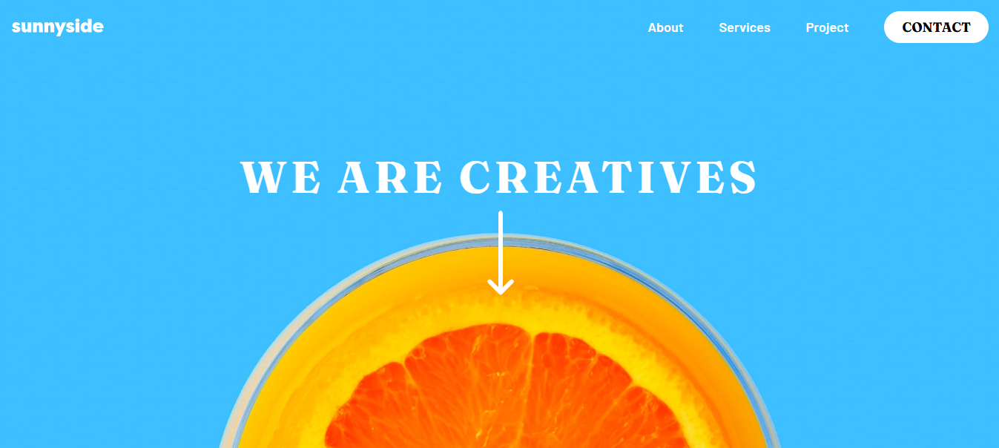

## Table of contents
  - [Screenshot](#screenshot)
  - [Links](#links)
- [My process](#my-process)
  - [Built with](#built-with)
  - [What I learned](#what-i-learned)
  - [Continued development](#continued-development)
  - [Useful resources](#useful-resources)
- [Author](#author)

### Screenshot

### Links

- Live Site URL: (https://sunnysideagencylp.netlify.app/)

## My process

### Built with

- React
- Tailwind CSS
- Mobile-first workflow

### What I learned

- I learned how to handle svgs in react easily by installing SVGR library
- How to make responsive designs with Tailwinds default breakpoints
- How to use the @apply property in Tailwind

### Continued development

 - React hooks like UseRef and UseContext. Need to touch up knowledge on that

### Useful resources

- [Example resource 1](https://www.example.com) - This helped me for XYZ reason. I really liked this pattern and will use it going forward.

## Author

- Github - [Shem](https://github.com/shemjay)

